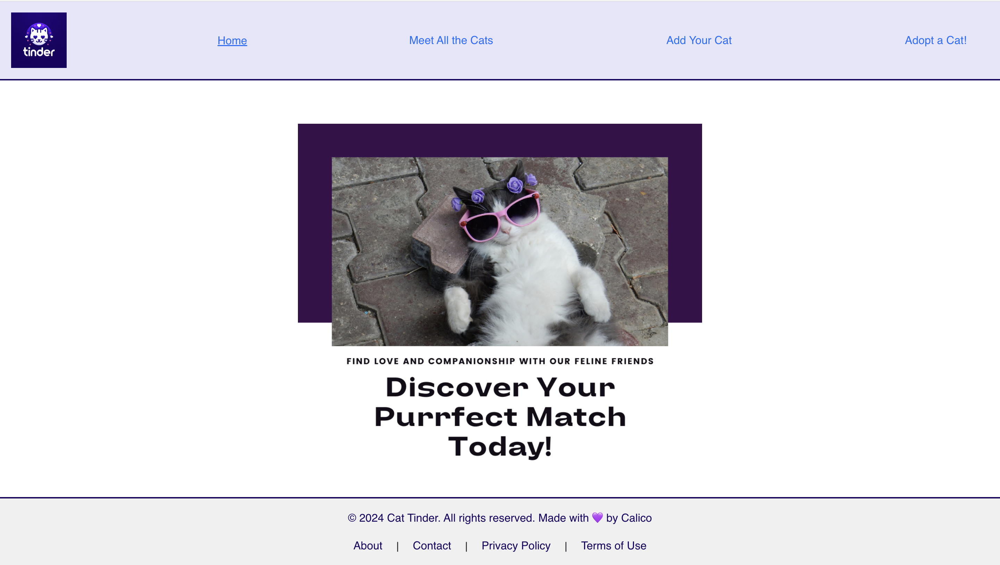
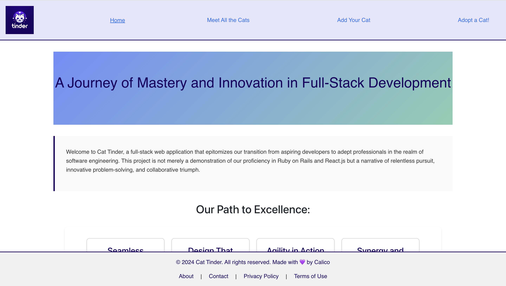
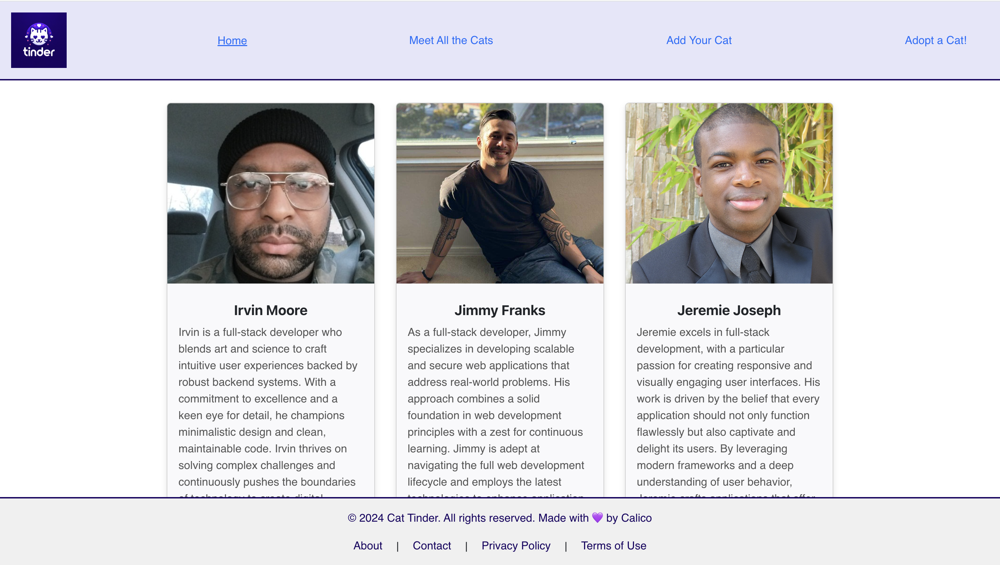
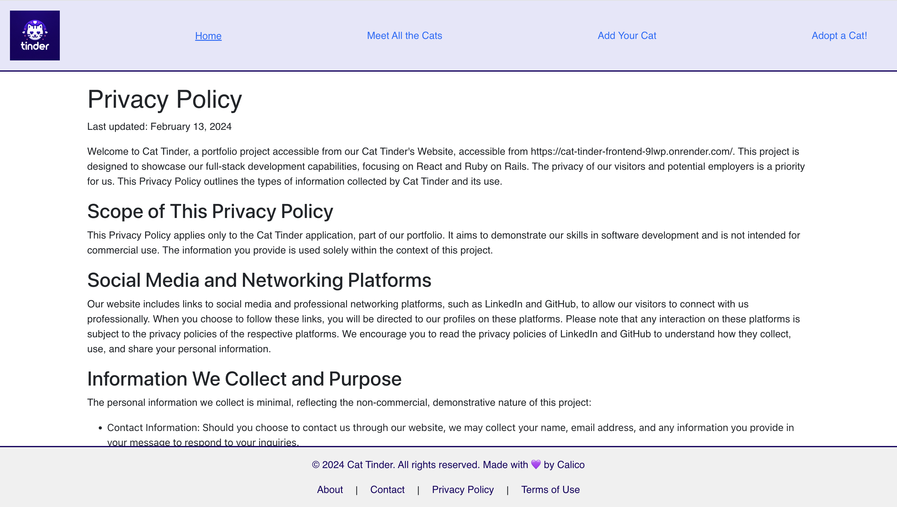
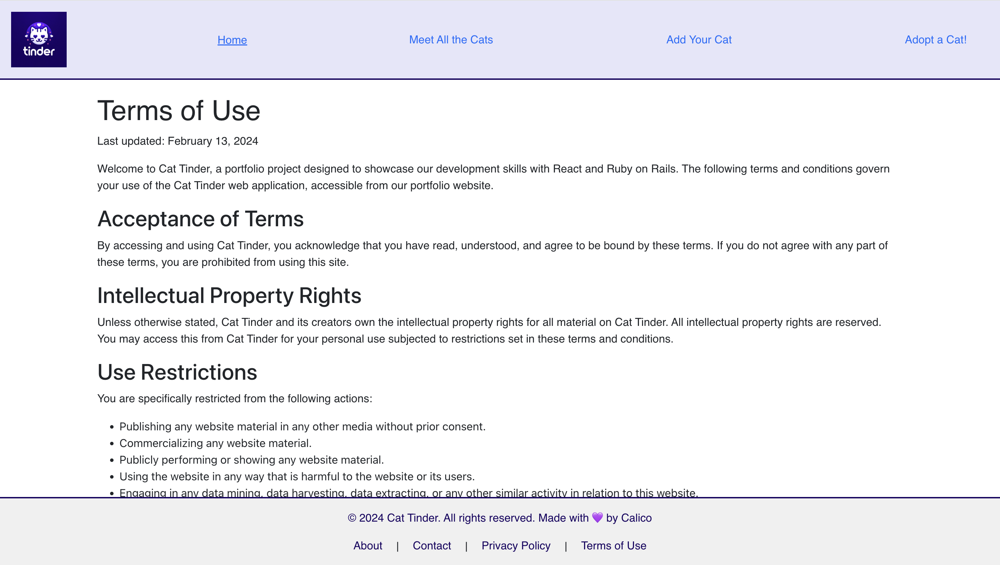
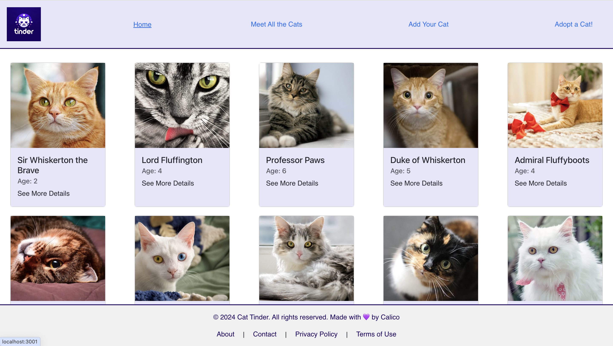
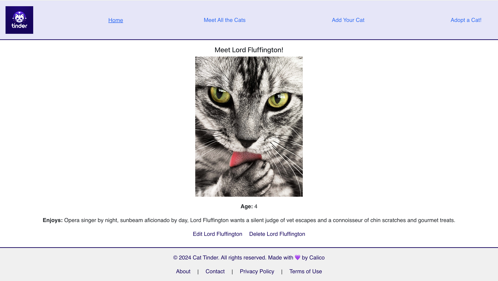
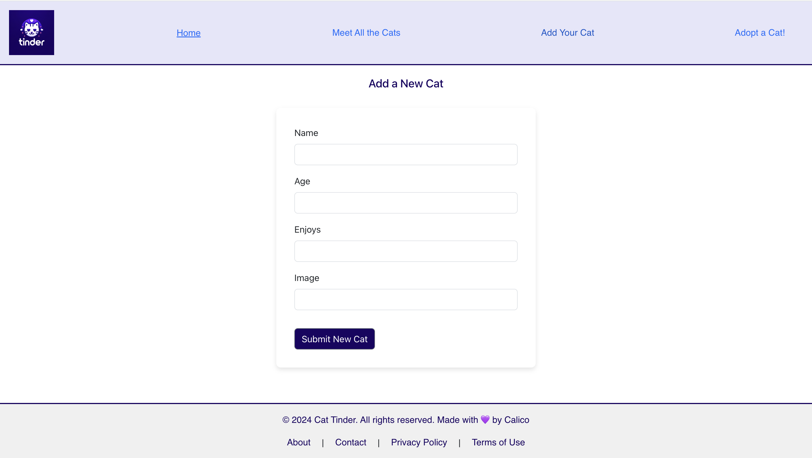
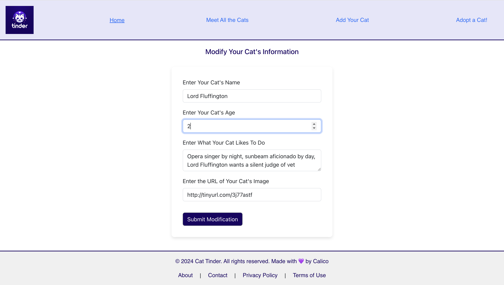
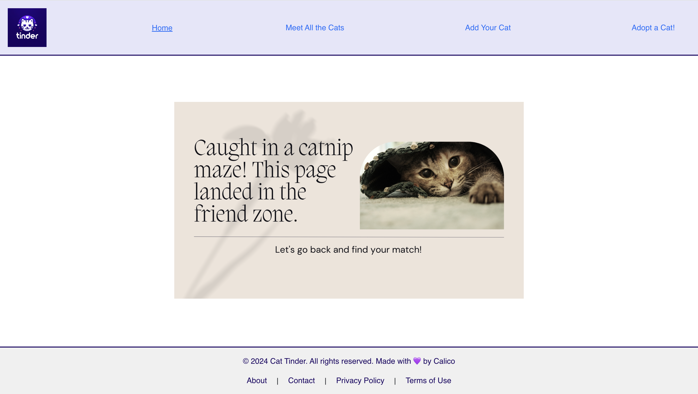

# Cat Tinder Web App

Cat Tinder is a unique full-stack, decoupled application designed for showcasing our journey from aspiring developers to proficient full-stack professionals. It mirrors the functionality of a dating app but for cats, focusing on integrating React for the frontend and Ruby on Rails for the backend API.

This project was bootstrapped with [Create React App](https://github.com/facebook/create-react-app).

## Getting Started

To get this app running locally:

- Clone this repo
- Use `yarn start` to start the frontend
- Navigate to the backend directory, run `rails server` to start the API

### Prerequisites

- Yarn
- Ruby on Rails
- PostgreSQL

## Available Scripts

In the project directory, you can run:

### `yarn start`

Runs the app in the development mode.\
Open [http://localhost:3000](http://localhost:3000) to view it in your browser.

The page will reload when you make changes.\
You may also see any lint errors in the console.

### `yarn test`

Launches the test runner in the interactive watch mode.\
See the section about [running tests](https://facebook.github.io/create-react-app/docs/running-tests) for more information.

### `yarn build`

Builds the app for production to the `build` folder.\
It correctly bundles React in production mode and optimizes the build for the best performance.

The build is minified and the filenames include the hashes.\
Your app is ready to be deployed!

See the section about [deployment](https://facebook.github.io/create-react-app/docs/deployment) for more information.

### `yarn eject`

**Note: this is a one-way operation. Once you `eject`, you can't go back!**

If you aren't satisfied with the build tool and configuration choices, you can `eject` at any time. This command will remove the single build dependency from your project.

Instead, it will copy all the configuration files and the transitive dependencies (webpack, Babel, ESLint, etc) right into your project so you have full control over them. All of the commands except `eject` will still work, but they will point to the copied scripts so you can tweak them. At this point you're on your own.

You don't have to ever use `eject`. The curated feature set is suitable for small and middle deployments, and you shouldn't feel obligated to use this feature. However we understand that this tool wouldn't be useful if you couldn't customize it when you are ready for it.

## Learn More

You can learn more in the [Create React App documentation](https://facebook.github.io/create-react-app/docs/getting-started).

To learn React, check out the [React documentation](https://reactjs.org/).

### Code Splitting

This section has moved here: [https://facebook.github.io/create-react-app/docs/code-splitting](https://facebook.github.io/create-react-app/docs/code-splitting)

### Analyzing the Bundle Size

This section has moved here: [https://facebook.github.io/create-react-app/docs/analyzing-the-bundle-size](https://facebook.github.io/create-react-app/docs/analyzing-the-bundle-size)

### Making a Progressive Web App

This section has moved here: [https://facebook.github.io/create-react-app/docs/making-a-progressive-web-app](https://facebook.github.io/create-react-app/docs/making-a-progressive-web-app)

### Advanced Configuration

This section has moved here: [https://facebook.github.io/create-react-app/docs/advanced-configuration](https://facebook.github.io/create-react-app/docs/advanced-configuration)

### Deployment

This section has moved here: [https://facebook.github.io/create-react-app/docs/deployment](https://facebook.github.io/create-react-app/docs/deployment)

### `yarn build` fails to minify

This section has moved here: [https://facebook.github.io/create-react-app/docs/troubleshooting#npm-run-build-fails-to-minify](https://facebook.github.io/create-react-app/docs/troubleshooting#npm-run-build-fails-to-minify)

## Features and Technologies

- **React.js**: for building dynamic user interfaces.
- **Ruby on Rails**: for API development.
- **PostgreSQL**: for data storage.
- **Postman**: for testing and documenting API endpoints.
- **Testing**: RSpec for Rails, Jest, and React Testing Library for React.

## Project Goals

Our objective with Cat Tinder was to demonstrate our ability to:

- Build a full-stack application
- Apply CRUD functionalities
- Design a responsive and user-friendly interface

## Screenshots and Descriptions

Below are screenshots from various pages of our app, each accompanied by a brief description highlighting its features and functionality.

| Page | Screenshot | Description |
|------|------------|-------------|
| **Home Page** |  | The welcoming front of our app, designed to immediately engage users with its sleek interface and intuitive navigation. |
| **About Page** |  | Delves into the story behind our application, showcasing the journey, technology stack, and the team’s collaborative effort. |
| **Contact Page** |  | Facilitates seamless communication with our team, equipped with user-friendly contact links for inquiries and feedback. |
| **Privacy Page** |  | Reinforces our commitment to user privacy with clear, concise information on data handling practices. |
| **Terms Page** |  | Defines the guidelines for using our app, ensuring users are informed about their rights and responsibilities. |
| **Cat Index Page** |  | A vibrant display of our cat profiles, featuring a responsive layout for browsing and interaction. |
| **Cat Show Page** |  | Highlights individual cat profiles with detailed descriptions, encouraging user engagement and interaction. |
| **Cat New Page** |  | Empowers users to contribute to our community by adding new cat profiles through an intuitive form interface. |
| **Cat Edit Page** |  | Allows for easy updates and modifications to cat profiles, showcasing the app’s dynamic content management capabilities. |
| **404 Page** |  | Elegantly handles navigation to non-existent routes with a custom 404 page, guiding users back to the main content. |

Each page has been crafted with attention to detail, ensuring a seamless and engaging user experience throughout our application.

## Contact Us

Interested in our project or looking for developers passionate about full-stack development? [Contact us](https://cat-tinder-frontend-9lwp.onrender.com/contact) for inquiries or more information.

## Acknowledgements

Thanks to everyone who supported us through this project, providing feedback, guidance, and encouragement.